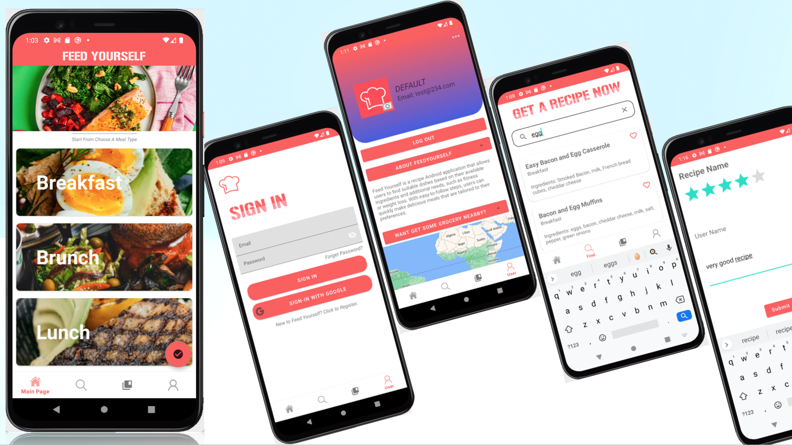

# Feed Yourself

This App is based on my android studio project from App Dev Course at NEU, I worked with two other team members in the course. We studied several topics about android development in that course. And I am now use the prototype we dicussed to recreate and make the project contents a real usable App.

## Description

This is a meal planner app that allows users to browse, search, and save recipes based on their preferences. The app offers a simple and clean user interface with various categories such as Breakfast, Brunch, Lunch, and Dinner.

## Features

- Choose from various meal types: Breakfast, Brunch, Lunch, and Dinner.
- Recipe filtering options: Popular, Score, and Latest.
- Recipe search with detailed information.
- Save recipes to your personal collection.
- Persistent bottom navigation with Home, Find, Saved List, and User sections.

## App Mockup

## Getting Started

These instructions will get you a copy of the project up and running on your local machine for development and testing purposes.

### Prerequisites

- Android Studio
- Android SDK

### Installing

1. Clone the repository.
2. Open the project in Android Studio.
3. Run the app on an emulator or an Android device.

